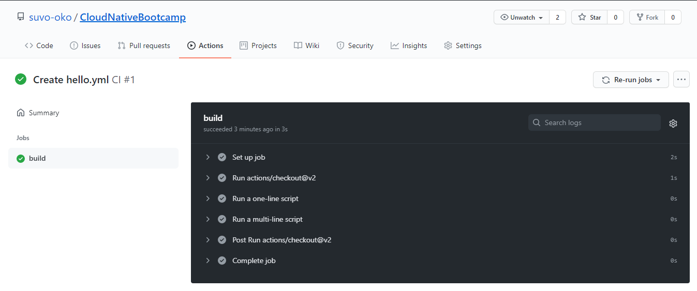

# Setting up your first GitHub Action

## Overview

- GitHub Actions help you automate tasks within your software development lifecycle
- Event-driven
- An event automatically triggers a *workflow*, which contains a *job*
- A job uses *steps* to control the order in which *actions* are run

## Components of GitHub Actions

### Workflows

- Automated procedure that you add to your repository
- Made up of one or more jobs
- Can be scheduled or triggered by an event

### Events

- A specific activity that triggers a workflow

### Jobs

- A set of steps that execute on the same runner

### Steps

- An individual task that can run commands in a job
- A step can be either an action or a shell command
- Each step in a job executes on the same runner

### Actions

- Standalone commands that are combined into *steps* to create a *job*
- The smallest portable building block of a workflow
- To use an action in a workflow, you must include it as a step

### Runners

- A server that has the *GitHub Actions runner application* installed
- A runner listens for available jobs, runs one job at a time, and reports the progress, logs, and results back to GitHub

## My first workflow

- GitHub Actions uses YAML syntax to define the events, jobs, and steps. These YAML files are stored in your code repository, in a directory called `.github/workflows`
  

  

  

<<<<<<< HEAD
 
=======
  
>>>>>>> f05ee5ebd18ae10f4e0c10dcfeebb13b9440389a

