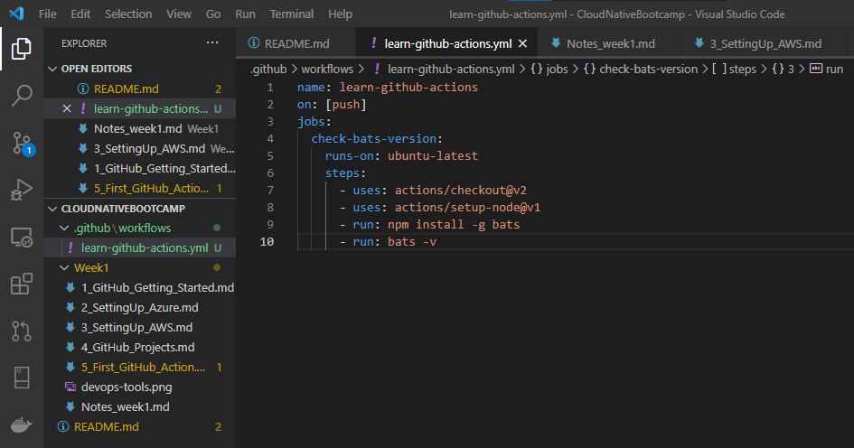
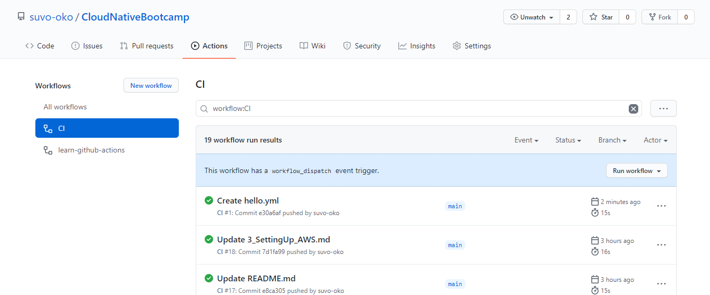

# Setting up your first GitHub Action

## Overview

- GitHub Actions is a platform to automate workflows.
- GitHub Actions can be used to implement continuous integration (CI) for code that is maintained in GitHub repositories.
- CI is the practice of using automation to build and test software every time a developer commits changes to version control.
- GitHub Actions help you automate tasks within your software development lifecycle
- GitHub Actions are *event-driven*. 
- An event automatically triggers a *workflow*, which contains a *job*.
- A job uses *steps* to control the order in which *actions* are run.
- There are two types of Actions: container actions and JavaScript actions.
  - With container actions, the environment is part of the action's code. These actions can only be run in a Linux environment that GitHub hosts. Container actions support many different languages.
  - JavaScript actions don't include the environment in the code, which means you'll have to specify the environment to execute these actions. Actions can run in a VM in the cloud or on-premises.
- GitHub Actions uses YAML syntax to define the events, jobs, and steps. These YAML files are stored in your code repository, in a directory called `.github/workflows`.

## Components of GitHub Actions

### Workflows

- Automated procedure that you add to your repository.
- Made up of one or more jobs.
- Can be scheduled or triggered by an event.

### Events

- A specific activity that triggers a workflow.
- An event is something that occurs on your repository. When this event occurs, it's going to trigger the jobs in the workflow.
- Some examples of events: a new pull request, the creation of a new branch, an issue or a tag, when a user forks a repository, when a new collaborator is added, etc.

### Jobs

- A set of steps that execute on the same runner.

### Steps

- An individual task that can run commands in a job
- A step can be either an action or a shell command
- Each step in a job executes on the same runner

### Actions

- Standalone commands that are combined into *steps* to create a *job*
- The smallest portable building block of a workflow
- To use an action in a workflow, you must include it as a step

### Runners

- A container environment that has the *GitHub Actions runner application* installed.
- A runner listens for available jobs, runs one job at a time, and reports the progress, logs, and results back to GitHub.
- By default, GitHub runs this container for you.

## My first workflow

  

  

  

  

