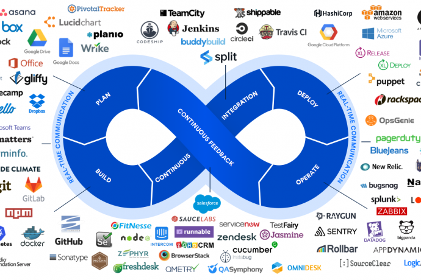

# DevOps Fundamental Skills

## Introduction

The most important thing: **DON'T PANIC**:exclamation::exclamation:

[Michael Levan](https://github.com/AdminTurnedDevOps) gives us an overview of predictions for 2021 and core DevOps concepts and skills.

## DevOps Predictions for 2021

- Culture and leadership
  - Organizations are starting to value the DevOps culture more and more
  - The ability to have multiple teams working together
  - We all need to find ways to communicate more
  - **Collaboration**
- Hybrid teams
  - Remote teams are the norm now
- Application security
  - Security is, unfortunately, an afterthought most of the times
  - Security must be at the forefront of every deployment decision
- Cloud adoption
  - The public cloud is expected to grow
- **DevOps is for the business**
  - DevOps is very much a business position, not simply an engineering one
  - Without DevOps there wouldn't be a business
  - The DevOps pro is a key stakeholder in the organization
- Developers will have more say
- DevOps is still one of the more increasingly needed roles

DevOps, as a position, has been around for a few years.

## Cloud Computing

- You are using resources that you don't own
- Microsoft or Amazon, or other cloud vendors, own the resources
- Renting of resources
- High availability
- Scalability
- Quick deployments

## Collaboration

- Communication
  - The ability to communicate with your team is crucial
  - A constant line of communication has to exist
- Working together
  - With good communication comes good ideas
  - With good ideas come good theories
  - With good theories come good products
- Working with management
  - The only way for a team to succeed
  - Management and engineers must be on the same page
- Working with other teams
  - It's all about communication and collaboration
- Goals should be aligned

## Working with the Business

- Management and engineering should always be on the same page
- Know when to say NO
- When you're in engineering, it's easy not to think about the business' goals and objectives
- Your own goals and the business goals must align

## Major DevOps Tooling

 

- Coding and development practices
  - Azure: most popular are PowerShell, Python and JavaScript
  - AWS: most popular are Python, JavaScript, Java and Go
- Orchestration (Kubernetes)
- Containerization (Docker, containerd, CRI-O)
  - Azure has its own containerization platform: Azure Container Instances (ACI)
  - In AWS, there are AWS Elastic Container Services and AWS Fargate
- Monitoring
  - Azure: Application Insights, Azure Monitor, Prometheus
  - AWS: Cloud Watch, Lambda Insights, Prometheus
- Cloud
- CI/CD
- Infrastructure-as-code

## Security Skills

- You don't have to be a hacker, but you have to have an understanding of software and development security skills
- Start thinking about security from the application perspective
- Faster deployments == more vulnerability
  - Many CI/CDs pipelines aren't checking for security vulnerabilities
- Core software security competencies
  - Static code analysis
  - Unit testing
  - Performance testing
  - **These tests should always be in the CI portion of your pipeline**

## Command Line (CLI)

- **You should be a command line wizard**
- A CLI tool is just a middle-man to an API
- Much quicker

## Version/Source Control

- A place to store code
- Version control == manage versions
- **Collaboration**
- Less bugs
- Code reviews
- The more eyes on the code the better
- Everyone is aware
- Centralized version control
  - One server
  - everyone uses the code from this one server
  - Very hard to collaborate
- Distributed version control
  - Most popular today
  - Allows anyone to download and have a working copy of the code on their local hosts, typically referred to as a local repo
  - Allows multiple people to work with the code at the same time

## CI/CD

- Build, test and create an artifact out of the code to be used in a deployment
- Deploy the code simply with the click of a button or as the code is committed to a repo
- Continuous Delivery: allows you to automatically deploy code daily, weekly, hourly, etc.
- Continuous Deployment: auto-deploy

## Guiding Principles & Winning Patterns :bulb:

1. Strategic empathy
    1. Take time to understand and share the perspective of another and obsess over customer experience
1. Laser focus
    1. Keep the main thing the main thing, ruthlessly eliminate distractions
1. High standards
    1. Great just isn't good enough. Our work is world-class
1. Long-term thinking
    1. Make short-term sacrifices for long-term success
1. Radical ownership
    1. Don't blame others or make excuses. Be resourceful and creative
1. Be scientific
    1. Reason from first principles, experiment, use data, test and iterate
1. Be decisive
    1. Speed matters in business. Commit fully, work hard, take initiative, and get things done
1. The truth is undeniable
    1. Be brutally honest and transparent with others, and most importantly, with yourself
1. Go big or go home
    1. Don't limit yourself to small thinking
1. Invent the new reality
    1. Focus on the vision and build to the new reality. Incrementally. Every day.

:star: :star: :star: :star: :star:
