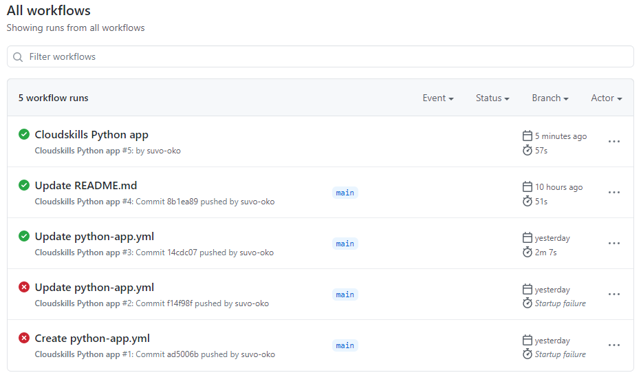
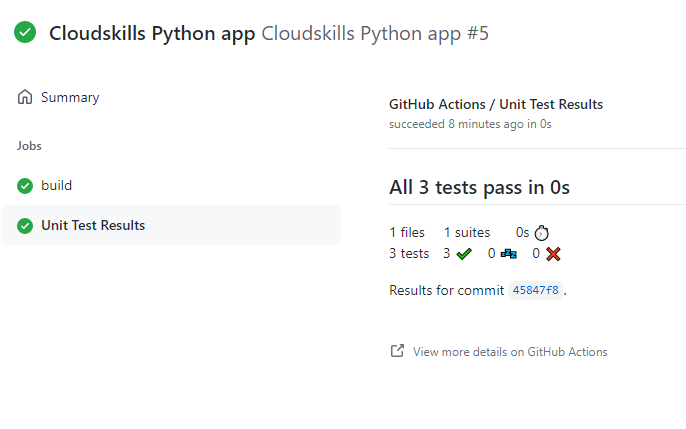

# Continuous Integration with GitHub Actions

- This project will focus solely on Continuous Integration using GitHub Actions.
- This can be a typical scenario for a business just starting to implement CI/CD for their applications.
- **The scenario for this lab**: when changes are pushed to any branch in our repository, an action will be triggered. It will run linting and unit tests to confirm that the application is valid. Like that, we can be more confident when we decide to merge the changes into the master branch.

## The Project

- We will use a sample Flask app for this exercise.
- The first step is to fork the project's repo to our own GitHub account. This is [my repository](https://github.com/suvo-oko/ci-pythonapp).
- Once we have the forked repo we go over to the Actions tab.
- GitHub Actions offers several sample actions we can use to get started. We're going to pick one from this list, from the *Continuous Integration* section, called *Python application*. As it says in the description, this action is used to test a Python application.
- When we click on `Set up this workflow`, a new folder called `.github/workflows` is created. Inside this folder, we will find our new workflow yaml file.
- After editing the file to fit our needs, we click on `Start commit` to create the actual pipeline.

## The Action file

Let's break down the yaml file.

Here, we give the Action a name and we define what will trigger the action, with the `on` parameter. In this case, there are two triggers: when we push a change to any branch and when we create a new file in any branch.

```yaml
name: Cloudskills Python app

on:
  push:
    branches:
      - '*'
  create:
    branches:
      - '*'
```

Now, the `jobs` section starts. Here. we'll say what actions to perform, in the order that they appear.

```yaml
jobs:
  build:

    runs-on: ubuntu-latest

    steps:
    - uses: actions/checkout@v2
    - name: Set up Python 3.9
      uses: actions/setup-python@v2
      with:
        python-version: 3.9
    - name: Install dependencies
      run: |
        python -m pip install --upgrade pip
        pip install flake8 pytest
        if [ -f Application/requirements.txt ]; then pip install -r Application/requirements.txt; fi
```

- We'll first build our environment.
- In our case, it will run inside a container running Ubuntu, hosted in GitHub's own servers.
- The `uses` parameter will call for GitHub's built-in actions, and the `run` parameter will execute command-line programs using the operating system's shell.
- Each action has its own repo, where you can consult its uses, and its more recent version.
- These are the two actions mentioned above:
  - [checkout](https://github.com/actions/checkout): this action checks out your repository, so the workflow can access it.
  - [setup-python](https://github.com/actions/setup-python): this action sets up a Python environment.
- The `run` parameter will upgrade pip, install the flake8 and pytest modules and the ones contained in the requirements.txt file.

```yaml
- name: Lint with flake8
      run: |
        # stop the build if there are Python syntax errors or undefined names
        flake8 . --count --select=E9,F63,F7,F82 --show-source --statistics
        # exit-zero treats all errors as warnings. The GitHub editor is 127 chars wide
        flake8 . --count --exit-zero --max-complexity=10 --max-line-length=127 --statistics
- name: Test with pytest
      run: |
        mkdir testresults 
        pytest Tests/unit_tests --junitxml=./testresults/test-results.xml
- name: Publish Unit Test Results
      uses: EnricoMi/publish-unit-test-result-action@v1.9
      with:
       files: ./testresults/test-results.xml
```

- There are three steps here: *Lint with flake8*, *Test with pytest*, and *Publish Unit Test Results*. The first two will execute a number of commands in the shell, and the third will execute an execute, obtained from the marketplace.

- To test our CI pipeline, we'll change the file and push it to a new branch. This should trigger the workflow.
- After cloning the repo to my local machine, I created a new branch, changed the index.html and pushed the changes to the GitHub repository.
- The GitHub Action works! The workflow has been triggered and the tests were correctly executed. See images below.

- These are the test results presented in this handy *junitxml* format.

